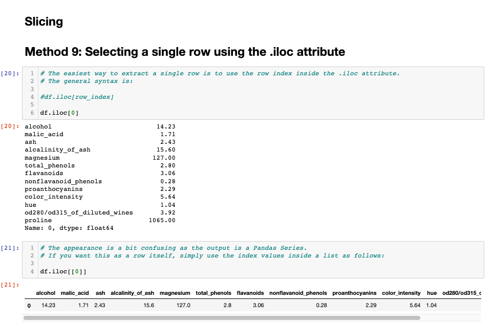

# Subsetting-a-Pandas-DataFrame
**Learning different format to subsetting a Pandas DataFrame**

## Overview

## Using the loc and iloc Methods

 

## Using the slicing Method 

  

## Using the Indexing Method

## Using the Filtering Method

## Summary 

**This has helped me understand the subsetting syntax of both loc and iloc methods tha is used in `Selection, Slicing, Indexing, and Filtering`. But the most importnat thing to remember is `iloc` needs integer values and (i for integer) whie `.loc` needs label values.**
